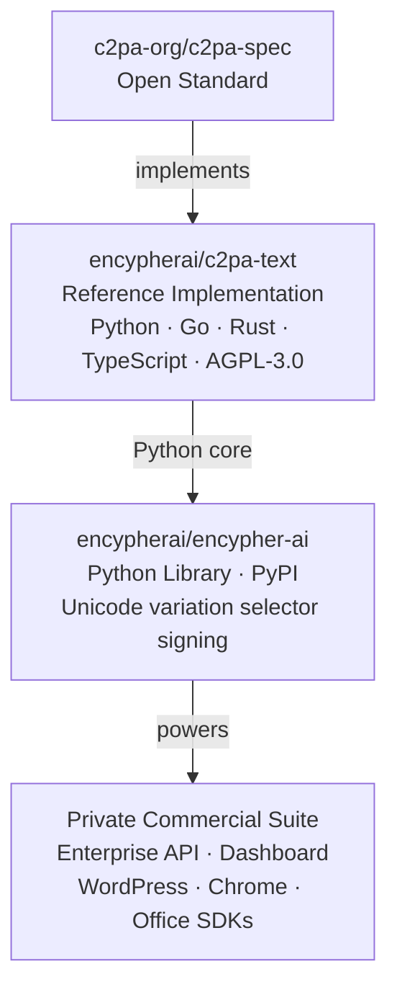
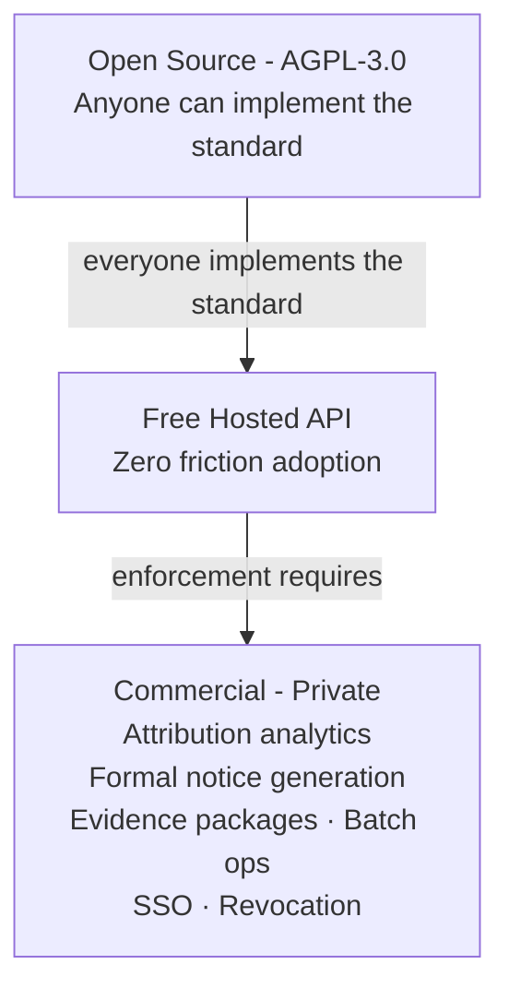

# Erik Svilich - Founder & CEO, Encypher

**Publishers lose attribution the moment their text is ingested by an AI.** Encypher solves that - cryptographic provenance, embedded invisibly in the text itself, that survives copy-paste, wire services, and aggregators.

Co-Chair, C2PA Text Provenance Task Force &nbsp;·&nbsp; Patent Pending &nbsp;·&nbsp; Open Source Core

---

## The Problem

When AI systems train on or reproduce publisher content, the original author and outlet disappear. There is no technical mechanism to prove origin after the fact - no metadata survives copy-paste, no EXIF equivalent exists for text. The result is willful infringement at scale, with publishers unable to detect it, quantify it, or enforce against it.

EncypherAI embeds a cryptographically signed, invisible payload directly into Unicode characters. The signature travels with the text, no matter where it ends up.

---

## Ecosystem



---

## Product Tiers



---

## Quick Start

```python
from encypher.core.unicode_metadata import UnicodeMetadata

# Embed verifiable provenance into any AI-generated text
signed_text = UnicodeMetadata.embed_metadata(text, private_key, payload)

# Verify - survives copy-paste, wire services, and aggregators
result = UnicodeMetadata.verify_text(signed_text, public_key)
# -> {'verified': True, 'payload': {...}, 'timestamp': '...'}
```

```bash
uv add encypher-ai
# or
pip install encypher-ai
```

---

## Why Now

Regulatory frameworks around AI transparency are advancing globally, with major jurisdictions now requiring disclosure of AI-generated or AI-manipulated content. The C2PA standard - the technical backbone EncypherAI implements - has been adopted by leading AI platforms, browser vendors, and camera manufacturers. Publishers and media organizations are actively looking for a standards-compliant way to assert and track provenance.

---

## Who This Is For

**Developers** - Drop-in provenance for any text pipeline. [`pip install encypher-ai`](https://pypi.org/project/encypher-ai/) · [Open an issue](https://github.com/encypherai/encypher-ai/issues)

**Publishers & Platforms** - If you're evaluating text provenance at the enterprise level, reach out on [LinkedIn](https://linkedin.com/in/eriksvilich).

**Researchers & Standards Contributors** - The reference implementation lives at [encypherai/c2pa-text](https://github.com/encypherai/c2pa-text). C2PA spec work happens at [c2pa-org/c2pa-spec](https://github.com/c2pa-org/c2pa-spec).

---

## Stack


---

## Connect

[](https://linkedin.com/in/eriksvilich)
[](https://encypherai.com)
[](https://github.com/eriksvilich)

---

## A Few Things About Me

Solo builder - I've written every line of the Encypher stack, from cryptographic core to commercial dashboard. Eagle Scout. FIRST Robotics alumnus. I think a lot about open-source sustainability, standards governance, and what it means to build infrastructure that the internet actually trusts.
